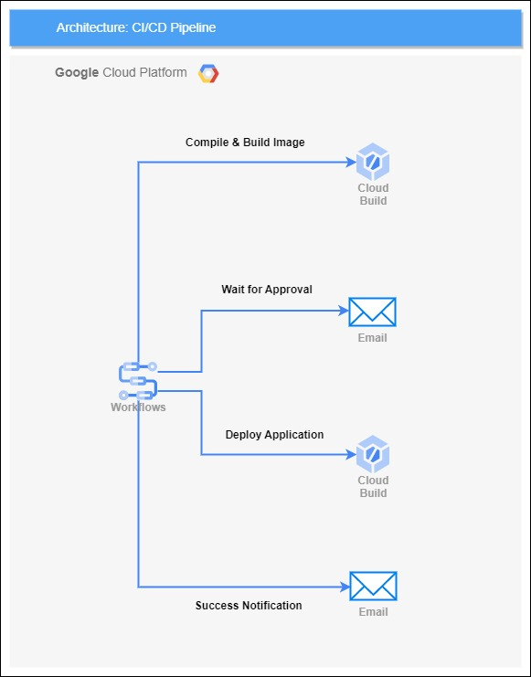

# HealthCheck

### 自動重新啟動故障主機

# UptimeCheck

### 自動重新啟動故障主機

# GCE Backup

### 排程備份主機

# CloudSQL Backup

### 排程備份資料庫

# GCS to BigQuery

### 將 GCS數據傳送到 BigQuery

# CI/CD Pipeline

### CI/CD Pipeline 步驟

### CI/CD Pipeline 組件
